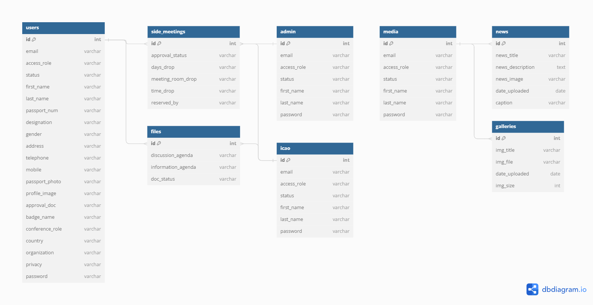

# 59th DGCA Website Project

## Overview

The 59th DGCA Website Projects is a strategic initiative aimed at optimising the digital infrastructure for the Directorate General of Civil Aviation (DGCA) Conference, exclusively serving nations within the Asia-Pacific Region (APAC). This web-based platform streamlines the submission of electronic files and programs, fostering seamless preparations ahead of the conference. It offers a user-friendly online registration system for APAC delegates and serves as a dynamic reservation hub for side-meetings, promoting efficient collaboration and diplomatic discussions on business matters.


## Project Features
- Optimized registration system for international delegates
- Real-time meeting room reservation
- File documentation and management
- Streamlined document approval and user experience
- ICAO standard friendly


## Getting Started

### Prerequisites
Before you begin, ensure you have met the following requirements:

- PHP (>=7.x)
- Composer
- Node.js and npm (for frontend assets)


### Installations
1. **Composer Dependencies**
```
composer install
```
2. **NodeJS Dependencies**
```
npm install
```
3. **Update or Create Database**
```
DB_DATABASE=your_database_name
DB_USERNAME=your_database_username
DB_PASSWORD=your_database_password
```
4. **Generate Key**
```
php artisan key:generate
```
5. **Migrate Database**
```
php artisan migrate
```
6. **Compile Frontend Asset**
```
npm run dev
```
7. **Run Laravel Project**
```
php artisan serve
```

## Database Model



## Change Logs
[!IMPORTANT]
Starting January 2024, the project has undergone several enhancements to improve its functionality, design, and overall user experience. Below are detailed summaries of the changes made in each log file:

1. [**User Navigation Bar**] (01-05-2024): 
    - Addressed login and registration issues, ensuring interface responsiveness.
    - Enhanced CSS and JavaScript for media queries and breakpoints, optimizing user navigation.
2. [**Paper/document placements**] (01-08-2024): 
    - Refined controllers for file uploading, organizing files based on dropdown input field categories.
3. [**Create meeting button**] (01-08-2024): 
    - Implemented a "Create Meeting" button for admin users, providing a streamlined process for initiating meetings.
4. [**Main Navigation**] (01-10-2024):
    - Revamped the navigation bar design for both user and admin interfaces.
    - Introduced a more aesthetic and user-friendly navigation structure for improved usability.
5. [**Page Responsiveness**] (01-11-2024): 
    - Applied CSS media query breakpoints tailored for specific devices and browsers.
    - Ensured a more interactive interface with enhanced responsiveness across various platforms.
6. [**Bootstrap Package**] (01-15-2024): 
    - Integrated Bootstrap UI and Vue.js packages and dependencies into the Laravel framework.
    - This addition sets the foundation for further development of the frontend framework.
